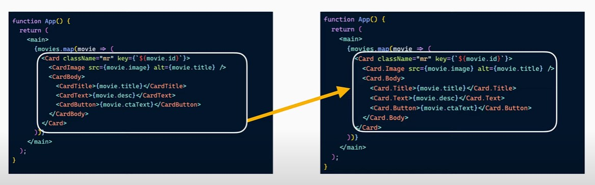

## Основыные понятия React

- SPA и модульность
- Virtual DOM, точка входа и рендеринг
- JSX-компоненты, пропсы, хуки
- Lifecycle компонентов
- UI-элементы и обработка данных

```tsx
// index.html <div id="root"></div>
const containerElement = document.getElementById('root');

// главный компонент
function App() {
  return <h1>Hello, React!</h1>;
}

// создание точки входа
const root = ReactDOM.createRoot(containerElement);
root.render(<App />);
```

---

## Слои React-приложения

1. Сам **React** (архитектура, компоненты, хуки, эвенты, стилизация, статические данные, HTML/CSS/JS)
2. Типизация React-приложения (**TypeScript**)
3. Стейт-менеджер (**Redux** toolkit)
4. Взаимодействие с **API** и **обработка данных** (URL, axios, апи-сервисы, логин, CRUD, localStorage, cookies, динамические данные и т.д.)
5. **Сборка и экосистема** (create-react-app, react-script, NextJS, Webpack, Parcel, npm-пакеты, env, линтеры, форматтеры, тестеры и т.д.)

---

6. **UI-фреймворк** для React (Material UI, bootstrap и т.д.) - опционально
7. **Backend** для React-приложения (сервер, SSR, бекенд-код, DB и т.д.) --> backend-разработчик
8. **Деплой** приложения на тестовый и продакшн-серверы --> DevOps-разработчик

---

## React-приложение позволяет

- Визуализировать (отображать данные статические или динамические)
- Изменять данные через состояние используя UI-элементы (useState, RTK)
- Бесшовное переключение страниц (без перезагрузки)
- Отправлять запросы к API и обрабатывать ответы
- В React можно использовать весть потенциал JS (как правило, то что можно на JS - можно и на React)

* в отличие от простых статических сайтов, Реакт позволяет добавить в свои приложения большую интерактивность и гибкость как для разработчиков, так и для пользователей.
* развбивать на компоненты можно не только фронтенд-приложение, а весь проект в целом делить на микро-сервисы. Фронтенд сейчас жестко не привязан к большому монолиту всего проекта (как раньше), а "живет своей отдельной жизнью"

---

## Архитектура React-приложения

- `components/` - переиспользуемые компоненты
- `utils/` - переиспользуемые утилиты
- `consts/` или `constants/`- переиспользуемые константы
- `store/` - Redux, mobx
- `routes/`, `pages/` или `containers/`- страницы приложения
- `styles/` - статичные стили
- `api/` - взаимодействие с API
- `static/` или `assets/` - статичные файлы (изображения, шрифты, иконки и пр.)
- `types/` или `interfaces/` - файлы переиспользуемой типизаци

---

### Components

```
components/
  icons/
  layout/
  ui/
```

---

### Store

```
store/
  effects/
  slices/
  reducer.ts
  store.ts
```

---

### API

```
api/
  methods/
  mocks/
  services/
  httpClient.ts
```

---

## SPA

В современном мире вместо слова сайт мы всё чаще говорим о веб-приложениях

_Веб-приложение_ — это приложение, доступное посредством интернета и работающее в браузере пользователя. В целом нет чёткой грани между понятием сайта и веб-приложения, часто это термины являются синонимами. В то же время современные сайты стараются быть похожими на обычные нативные приложения.

Основное отличие многостраничного сайта от нативного приложения в том, что для открытия новой страницы в браузере происходит перезагрузка страницы, а в приложениях <mark>переход на новую страницу происходит бесшовно, без перезагрузок</mark>. Бесшовный, почти мгновенный переход на новую страницу, гораздо приятнее для пользователя, чем перезагрузки. Поэтому сейчас вместо классических многостраничных приложений принято разрабатывать так называемые SPA (одностраничное приложение).

---

## React

[React official docs](https://react.dev) - ru.reactjs.org

**React** — это JavaScript-библиотека для создания пользовательских интерфейсов. Она позволяет собирать сложный UI из маленьких изолированных кусочков кода, называемых «компонентами».

Во Frontend-разработке часто приходится сталкиваться с понятиями: **библиотека** и **фреймворк**. Под библиотеками обычно подразумевают набор функций и модулей, упрощающих разработку конкретного функционала приложений, например, рендеринга контента. В свою очередь, использование фреймворков обычно упрощает разработку всего приложения, предоставляя готовые архитектурные решения. В современном мире грани между этими двумя понятиями не всегда бывают чёткими, и сам термин бывает не столь важен, как важны удобства самого решения.

**Формально React** — это библиотека, которая поставляется с официальной подробной документацией, есть также большое комьюнити и типовые решения. Всё это серьёзно упрощает разработку архитектуры приложения на React и в какой-то мере придаёт ему признаки фреймворка.

**React** относится к реактивным фреймворкам и библиотекам, в которых элементы приложения в общих чертах представляют собой данные и шаблон, зависящий от этих данных. При изменении данных шаблон автоматически перерисовывается, и пользователь всегда видит актуальный интерфейс без необходимости вручную вызывать методы DOM API.

Библиотека React вместе с документацией и опытом комьюнити предоставляет множество уже готовых архитектурных решений, что часто позволяет избежать самостоятельного проектирования приложения практически с нуля.

- Virtual DOM
- SPA. Смена роутов без перезагрузки страницы
- Жизненный цикл компонентов (Монтирование, размонтирование, получение новых данных)
- Модульность. Во внутрь компонента можно импортировать все что угодно
- ES6, jsx-шаблонизацию и синтаксический сахар

Простыми словами React:

- реалиует взаимодействия пользователей с данными. К-С-взаимодействие (React - это про интерфейс)
- Разделяет код (React - это не монолит, это про компоненты)
- Посылает запросы на сервер
- Обрабатывает ответы с сервера --> Отрисовывает данные, полученные с сервера
- Отрисовывает статичные данные (хардкод)
- Непонятные задачи --> Созваниваться с тем, кто её ставил и спрашивать все непонятные моменты

---

## Основные понятия

- SPA
- Virtual DOM
- Компоненты
- Пропсы
- Жизненный цикл
- Рендер, ре-рендер
- Стейт компонента
- Стор приложения
- Посыл запроса
- Получение ответа
- Отрисовка данных
- Мутация данных (`data --> data'`)

---

## Сложности

- Компоненты-портянки --> декомпозиция
- Непонятный код, который разрабатывал не ты --> 1 вариант: переписать, 2 вариант: постараться понять
- Разношерстный код --> Вводить стайлгайды и линтеры

Сложный код - это как правило комбинация блоков из простого кода, чтобы понять сложное, нужно выделить из него простые блоки и

---

## Virtual DOM

- Реактивность (создание DOM, с помощью JS гораздо быстрее, чем переключение между статичными html-страницами);
- Virtual DOM строиться на основе jsx-разметки компонентов React-приложения;
- Real DOM это точная копия Virtual DOM в определенный момент времени;
- На основе Virtual DOM создается Real DOM через js-метод `createElement()`;
- Real DOM постоянно сравнивается с Virtual DOM, и если Virtual DOM будет отличается от Real DOM, то именно то, что отличается будет сразу обновлено в Real DOM;
- Процесс создания/удаления/обновления Real DOM на основе Virtual DOM называется **жизненным циклом компонентов** React-приложения

---

## Lifecycle

**Mount**/**Render** --> **Update** --> **Unmont**

---

**Шаблонизатор** — программа, выделенная в отдельную библиотеку, которая позволяет описывать шаблоны документа, и на их основе совместно с переданными данными генерировать конкретные документы.

Шаблонизаторы расширяют язык описания документа специальными символами, которые выделяют динамическую часть документа, зависящую от переданных данных. При использовании шаблонизатора не нужно следить за данными и вручную обновлять DOM-дерево в соответствии с изменившимися данными, например, после пользовательского ввода. Шаблонизатор создаёт связь между шаблоном и данными, генерируя новую разметку при изменении данных.

При этом JSX позволяет использовать шаблонизацию, для этого в нём предусмотрен синтаксис фигурных скобок. Через фигурные скобки {} можно вставлять в разметку любые выражения из JavaScript.

Выражение — это конструкция языка JavaScript, которая возвращает значение.

Хотя JSX очень похож на HTML, полезно понимать, что это не совсем HTML и в конечном счёте он будет преобразован в JavaScript. Также в JSX есть некоторые отличия от HTML, например, вместо атрибута class, используемого для указания CSS-классов, нужно использовать className.

Благодаря JSX, код React-компонентов выглядит по-настоящему декларативно. Не требуется описывать, какие инструкции в DOM-дереве выполнять для отрисовки желаемых элементов. Вместо этого в качестве возвращаемого значения мы указываем JSX-код на HTML-подобном синтаксисе с описанием интерфейса, который нужно отобразить на месте компонента

---

## Компоненты

Компоненты - "кусочки" приложения. Компоненты позволяют реализовывать «атомарные» части пользовательского интерфейса один раз и независимо. Такой подход позволяет переиспользовать уже написанные ранее компоненты. В каждом компоненте можно реализовать свой интерфейс взаимодействия.

Компоненты могут быть сложными: состоящими из других компонентов, которые также атомарные.
Этот подход применим не только к общей вёрстке, но и к:

- JavaScript,
- CSS,
- HTML,
- интерфейсам взаимодействия.

**Компонент** — это независимая сущность, которая описывает обособленный кусочек пользовательского интерфейса и содержит в себе весь необходимый код — HTML и Javascript. Например, компонентом является кнопка или карточка товара.

Мы уже говорили о важности модульности в современной архитектуре и о том, что компоненты — это и есть те самые модули во Frontend-разработке, на которые можно разбить сложные интерфейсы

Используя компонентный подход, мы не пытаемся сразу сверстать большую страницу. Вместо этого мы разбиваем её на компоненты. Далее создав компоненты, мы как из конструктора собираем из них большую HTML-страницу. Более того, мы можем переиспользовать эти компоненты при создании новых страниц, потому что компоненты независимы.

Компонентный подход делает код модульным, что позволяет разбивать сложные интерфейсы на более маленькие обособленные кусочки, а также переиспользовать уже готовые компоненты для создания новых страниц.

Функциональный компонент в React — это JavaScript-функция, которая на входе получает объект с данными (props), нужными для отрисовки компонента, а на выходе возвращает кусочек интерфейса в виде React-элементов.

**React-элемент** — это JavaScript-объект, описывающий узел DOM-дерева. Он имеет специальный формат, который React умеет обрабатывать и отображать на странице.

**Props** — набор параметров, передаваемых в компонент. В React эти параметры представляют собой свойства объекта, который передаётся в компонент как параметр функции.

```jsx
function HelloWorld(props) {
  const computedDate = props.date ? props.date : '29.05.2013';

  return (
    <h1>
      Привет, Мир!!! Моё приложение создано: <b>{computedDate}</b>
    </h1>
  );
}

const root = createRoot(document.getElementById('root'));
root.render(HelloWorld({ date: '13.02.23' }));
```

Здесь функция **HelloWorld** является React-компонентом. На входе она получает объект props. Все данные, передаваемые в компонент, обязательно являются свойствами объекта props. Их нельзя делать отдельными параметрами функции — таков интерфейс React-компонента. Внутри функции можно выполнять различные необходимые операции над данными. В нашем примере мы проверяем, была ли передана дата через props и, если не передана, то на её месте выводим дату первого релиза библиотеки React.

### Пример jsx-компонента

**Элементы** — это «строительные кирпичики», из которых создаются компоненты. Одним словом, это основа для компонентов. В ранее рассмотренных примерах h1 — это элемент.

React поддерживает два вида компонентов: функциональные и классовые. Здесь мы привели пример функционального компонента. Функциональный компонент — обычная функция. Компонентом его делает факт, что эта функция возвращает JSX.

```jsx
const containerElement = document.getElementById('root');

function App() {
  return <h1>Hello, world!</h1>;
}

// Отрисуем элемент в контейнере
const root = ReactDOM.createRoot(containerElement);
root.render(<App />);
```

### React.createElement (без babel)

- Babel: JSX --> React

```jsx
const element = React.createElement('h1', null, 'Hello React!');
const element = React.createElement('h1', { className: 'text-underline' }, [
  'children1',
  'children2',
]);
```

### Babel

```jsx
const title = <h1 className="title">Hello React!</h1>;
const text = <p>Мой первый компонент</p>;

...

<div className="container">{title}{text}</div>
```

### Запись через функцию

```tsx
// export
export function SomeComponent() {
  return <div>SomeComponent</div>;
}

// export default
export default function SomeComponent() {
  return <div>SomeComponent</div>;
}
```

---

### Запись через константу

```tsx
const SomeComponent = () => {
  return <div>SomeComponent</div>;
};

export default SomeComponent;
```

---

### Запись через класс

```tsx
import { Component } from 'react';

class SomeComponent extends Component {
  render() {
    return <div>SomeComponent</div>;
  }
}

export default SomeComponent;
```

---

## Пропсы (props)

Пропсы - каналы передачи данных между компонентами, любые js-данные.

Передача данных в компоненты осуществляется через пропсы (props). Это самый обычный объект. Получается, чтобы воспользоваться данными, нужно обратиться к определённому свойству объекта.

- Пропсы можно только читать, в них нельзя ничего записывать. А когда пропсы изменяются, компонент перерисовывается.

```jsx
const Button = props => {
  return <button {...props}>Нажми на меня!</button>;
};

const App = () => {
  return (
    <Button
      className='btn btn-primary'
      onClick={() => console.log('Нажали!')}
    />
  );
};
```

Значения false, null, undefined и true не рендерятся. Поэтому удобно использовать оператор && для условного рендеринга.

```jsx
<h1>Hello, {showUserName && userName}</h1>
```

---

## SPA

**Одностраничные приложения** (Single Page Application, или SPA) — это не сайты-визитки. Всё намного сложнее. Это полноценное веб-приложение, в котором подгружается один index.html как каркас для всего проекта, а в дальнейшем с помощью JavaScript, AJAX, History API и других инструментов подставляются или заменяются на лету новые данные. То есть вёрсткой и стилями «лэндинга» дело не заканчивается.

На выходе получаем ровно такое же многофункциональное приложение как, например, интернет-магазин, форум или онлайн-кинотеатр. Но с одним большим отличием — не происходит перезагрузка для получения нового HTML-файла. Это значит, что тратится меньше трафика и времени, и как бонус в обе стороны не гоняются одни и те же данные. Дёшево и удобно.

SPA умеют переключаться между страницами без обновления, что для пользователя с большой вероятностью будет выглядеть как чистая магия. Не нужно ждать загрузки, сайт откликается мгновенно да и визуально выглядит как «будущее уже здесь». Это в свою очередь улучшает пользовательский опыт и повышает повторную посещаемость.

### Основные элементы, которые используют в SPA:

- шаблонизатор,
- History API,
- API бэкенда (общение через HTTP),
- сервисы для работы с MVC, MV\*, MVVM архитектурами (написан ли сервис своими силами или использована готовая библиотека — неважно).

---

## React Compound Components



```tsx
import { ReactNode } from 'react';

const Card = ({ children }: { children?: ReactNode }) => {
  return <div>{children}</div>;
};

const Title = ({ children }: { children?: ReactNode }) => <h2>{children}</h2>;

const Text = ({ children }: { children?: ReactNode }) => <p>{children}</p>;

const Button = ({ text, onClick }: { text: string; onClick: () => void }) => (
  <button onClick={onClick}>{text}</button>
);

Card.Title = Title;
Card.Text = Text;
Card.Button = Button;

const SomeComp = () => {
  return (
    <Card>
      <Card.Title>Title</Card.Title>
      <Card.Text>
        Lorem ipsum dolor sit, amet consectetur adipisicing elit. Commodi
        aperiam repellendus voluptate corrupti? Error consequuntur ea, in
        mollitia, reiciendis, et minima possimus officia quisquam quod sit
        eligendi! Officia, voluptatibus doloribus.
      </Card.Text>
      <Card.Button text='Click me' onClick={() => alert('Clicked')} />
    </Card>
  );
};

export default SomeComp;
```

```tsx
interface TParentProps {
  children: React.ReactNode;
}
const Parent = (props: TParentProps) => <div>{props.children}</div>;

// Child
interface TChildProps {
  children: React.ReactNode;
}
const Child: React.FC<TChildProps> = ({ children }) => <div>{children}</div>;

Parent.Child = Child;

export default Parent;
```
