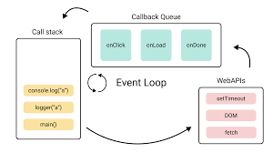

- [События: от браузерных до пользовательских» от Игоря Зубова](https://www.youtube.com/watch?v=aNMdUUuBFmo)
- [Описание событий на MDN](https://developer.mozilla.org/en-US/docs/Web/Events)
- [preventDefault()](https://developer.mozilla.org/ru/docs/Web/API/Event/preventDefault)
- [stopPropagation()](https://developer.mozilla.org/ru/docs/Web/API/Event/stopPropagation)
- [Всплытие и погружение](https://learn.javascript.ru/bubbling-and-capturing)



JS однопоточный. Очередь событий.

## События в браузере

Для реакции на действия пользователя или внутреннее взаимодействие кода используют события — сигнал от браузера о том, что что-то произошло.
События можно разделить на группы — в зависимости от устройства или элемента интерфейса, который дал им начало:
События мыши

- `click` — клик левой кнопкой мыши;
- `contextmenu` — клик правой кнопкой мыши;
- `mouseover/mouseout` — курсор попадает на элемент или уходит с него;
- `mousedown/mouseup` — кнопку мыши нажали или отпустили;
- `mousemove` — движение курсора над элементом.

`click, submit, dblclick, keydown, keyup, keypress, mouseover, mouseout, reset, focus, focusin, focusout, change, blur`

---

### События клавиатуры

- `keydown` — клавишу нажали;
- `keyup` — клавишу отпустили.

[key-codes](https://www.cambiaresearch.com/articles/15/javascript-char-codes-key-codes)

```js
el.addEventListener('keydown', function(e) {
  // js for keypress;
  if (e.keyCode == 27) { ... }
});
```

---

### События при нажатии пальцем

- `touchstart` — элемента коснулись;
- `touchmove` — по элементу провели пальцем;
- `touchend` — касание закончилось и палец убрали;
- `touchcancel` — палец переместился на интерфейс браузера или тач-событие нужно отменить.

```js
el.addEventListener('click', event => {
  // do smth
});
```

---

### События на элементах управления

- `submit` — нажали кнопку «Отправить» формы &lt;form&gt;;
- `reset` — сбросили форму &lt;form&gt;;
- `focus` — пользователь фокусируется на элементе, например, нажимает на &lt;input&gt;;
- `blur` — пользователь выходит из фокуса элемента, например, кликает вне &lt;input&gt;.

Больше событий описано на [MDN](https://developer.mozilla.org/en-US/docs/Web/Events).

```js
// onchange
el.onchange = () => { ... }

// onsubmit
el.onsubmit = () => { ... }

// onload
<body onload="alert('Страница загружена');">
```

---

## Подписки. Добавление обработчика

Обработчик (от англ. handler) — это функция, которая отрабатывает, как только произошло событие. Именно он позволяет JavaScript-коду моментально реагировать на действия пользователя.

---

### Через атрибут

Передать обработчик можно напрямую через атрибут onclick. У такого способа много ограничений и неудобств. Использовать его не стоит, кроме случаев, где это действительно нужно.

```html
<button onclick="this.parentElement.innerHTML+='<span>click</span>'">
  Нажми меня
</button>
```

---

### Через свойства DOM-элемента

У элементов есть свойства on\*, в которых можно присваивать обработчики. Но нужно быть готовым к тому, что явное присваивание заменяет все прошлые обработчики. Этот способ лучше не использовать без особой необходимости.

```js
let count = 0;
const element = document.getElementsByTagName('BUTTON')[0];

element.onclick = function () {
  element.innerHTML = `Кликнули ${++count} раз`;
};
```

---

### addEventListener и removeEventListener

Самый верный способ навесить и удалить обработчик. Настоятельно рекомендуем использовать по умолчанию именно эти два метода:

```js
// Добавление обработчика
element.addEventListener(event, handler);

// Удаление обработчика
// Нужно передать те же аргументы, что были у addEventListener
element.removeEventListener(event, handler);

////////////////////////////////////////////////

// Вот такой способ не сработает
// (в аргументах хоть внешне и одинаковые, но по сути разные функции)
element.addEventListener(event, () => '');
element.removeEventListener(event, () => '');

// Вот такой способ сработает (в аргументах одна и та же функция)
const handler = () => '';
element.addEventListener(event, handler);
element.removeEventListener(event, handler);
```

Подробнее про addEventListener [на MDN](https://developer.mozilla.org/ru/docs/Web/API/EventTarget/addEventListener).

---

### event

Обработчики принимают на вход объект события event. Он сообщает свойства элемента на момент реагирования, что изменилось и что добавилось. Например, какая клавиша нажата. То есть можно определять не только абстрактные общие вещи вроде «нажали что-то».

```js
element.addEventListener('click', function (event) {
  console.log(`${event.type} на ${event.currentTarget}`);
  console.log(`${event.clientX}:${event.clientY}`);
});
```

У `event` есть много разных свойств и методов. Подробный список найдёте [на MDN](https://developer.mozilla.org/ru/docs/Web/API/Event).
Свойства, которые показаны в примере:

- `event.type` — тип события (в примере это 'click').
- `event.currentTarget` — на каком элементе сработал обработчик. Не путайте с event.target, то есть исходным элементом, на котором произошло событие. Они могут быть разными из-за всплытия событий, о которых расскажем дальше.
- `event.clientX / event.clientY` — свойства событий мыши, показывают координаты курсора относительно окна в момент клика.

---

## Всплытие событий

Всплытие работает следующим образом. Сначала отрабатывают события на самом вложенном элементе, затем на его родителе, и так далее, вверх до window.

Например, возьмём форму. При нажатии на текст P будет показано три alert в следующем порядке:

- alert('p') ,
- alert('div'),
- alert('form').

```js
<form onclick="alert('form')">
  FORM
  <div onclick="alert('div')">
    DIV
    <p onclick="alert('p')">P</p>
  </div>
</form>
```

### Событие проходит следующие стадии:

1. Перехват (capturing) — событие проходит сверху вниз.
2. Цель (target) — событие достигло целевого элемента.
3. Всплытие (bubbling) — событие идёт снизу вверх.

Самый глубокий элемент, который вызывает событие, называется целевым (target). Доступен из объекта события как event.target.

```js
eventform.addEventListener('click', function (event) {
  console.log('target = ', event.target.tagName); // target = FORM
  console.log('this = ', this.tagName); // this = FORM
});
```

### Работа с событием

- `event.preventDefault()` — отменяет обработчик по умолчанию,

Код ниже вызовет переход на другую страницу, потому что таково поведение формы по умолчанию:

```html
<form onsubmit="alert('submit!');">
  Первый пример: нажмите Enter: <input type="text" value="Текст" /><br />
  Второй пример: нажмите на кнопку "Отправить":
  <input type="submit" value="Отправить" />
</form>
```

Но если к обработчику в `addEventListener` добавить `preventDefault`, то перехода на другую страницу не будет.

- `event.stopPropagation` — прекращает всплытие (например, при нажатии на кнопку не вызовет стандартное поведения &lt;form&gt;).
- `event.stopImmediatePropagation` — прекращает всплытие и не выполняет оставшиеся обработчики события.

### Перехват события

- `on*` — обработчики не обрабатывают перехват;
- `element.addEventListener('event', callback, false)` — обработка на стадии всплытия (поведение по умолчанию);
- `element.addEventListener('event', callback, true)` — обработка на стадии перехвата.

### Делегирование событий

Рассмотрим пример со списком. Есть список, в котором много дочерних элементов:

```html
<ul>
  <li>0</li>
  <li>1</li>
  <li>2</li>
</ul>
```

Как можно навесить обработчик на все элементы?

```js
const logger = function (event) {
  console.log(event.target.innerHTML);
};

const liElements = document.getElementsByTagName('li');

for (let i = 0; i < liElements.length; i++) {
  const li = liElements[i];
  li.addEventListener('click', logger);
}
```

Можно сделать намного проще, используя знания о делегировании, всплытии и перехвате:

```js
const logger = function (event) {
  if (event.target.tagName === 'LI') {
    console.log(event.target.innerHTML);
  }
};

const ul = document.getElementsByTagName('ul')[0];
ul.addEventListener('click', logger);
```

Преимущества данного подхода:

- один обработчик вместо множества;
- при добавлении новых элементов им не нужно добавлять обработчик.

---

### onClick пример

Сработает только последний

```js
btn.onclick = function () {
  result.push('first event');
  console.log(result);
};

btn.onclick = () => {
  result.push('second event');
  console.log(result);
};

btn.click();
```

Навешивание обработчика

```js
const btn = document.querySelector('.button');

const result = [];

btn.addEventListener('click', function (event) {
  result.push('first event');
  result.push('second event');
  console.log(result);
});
```

---

## Event loop

Бесконечный цикл, который постоянно крутиться интерпретатором и улавливает все события.

После того, как отлавливает события, то записывает их в СТЕК(очередь) ЗАДАЧ.

Задачи выполняются АСИНХРОННО, это означает, что если какая-либо задача выполняется, то Event loop не прекращается свою работу, а будет улавливать все события постоянно.

---

## Список событий

<table>
<tbody><tr>
    <th>Event</th>
    <th>Occurs When</th>
    <th>Belongs To</th>
</tr>
<tr>
<td><a href="#">abort</a></td>
<td>The loading of a media is aborted</td>
<td><a href="#">UiEvent</a>, <a href="#">Event</a></td></tr>
<tr>
<td><a href="#">afterprint</a></td>
<td>A page has started printing</td>
<td><a href="#">Event</a></td>
</tr>
<tr>
<td><a href="#">animationend</a></td>
<td>A CSS animation has completed</td>
<td><a href="#">AnimationEvent</a></td>
</tr>
<tr>
<td><a href="#">animationiteration</a></td>
<td>A CSS animation is repeated</td>
<td><a href="#">AnimationEvent</a></td>
</tr>
<tr>
<td><a href="#">animationstart</a></td>
<td>A CSS animation has started</td>
<td><a href="#">AnimationEvent</a></td>
</tr>
<tr>
<td><a href="#">beforeprint</a></td>
<td>A page is about to be printed</td>
<td><a href="#">Event</a></td>
</tr>
<tr>
<td><a href="#">beforeunload</a></td>
<td>Before a document is about to be unloaded</td>
<td><a href="#">UiEvent</a>, 
  <a href="#">Event</a></td>
</tr>
<tr>
<td><a href="#">blur</a></td>
<td>An element loses focus</td>
<td><a href="#">FocusEvent</a></td>
</tr>
<tr>
<td><a href="#">canplay</a></td>
<td>The browser can start playing a media (has buffered enough to begin)</td>
<td><a href="#">Event</a></td>
</tr>
<tr>
<td><a href="#">canplaythrough</a></td>
<td>The browser can play through a media without stopping for buffering</td>
<td><a href="#">Event</a></td>
</tr>
<tr>
<td><a href="#">change</a></td>
<td>The content of a form element has changed</td>
<td><a href="#">Event</a></td>
</tr>
<tr>
<td><a href="#">click</a></td>
<td>An element is clicked on</td>
<td><a href="#">MouseEvent</a></td>
</tr>
<tr>
<td><a href="#">contextmenu</a></td>
<td>ПКМ: An element is right-clicked to open a context menu</td>
<td><a href="#">MouseEvent</a></td>
</tr>
<tr>
<td><a href="#">copy</a></td>
<td>The content of an element is copied</td>
<td><a href="#">ClipboardEvent</a></td>
</tr>
<tr>
<td><a href="#">cut</a></td>
<td>The content of an element is cut</td>
<td><a href="#">ClipboardEvent</a></td>
</tr>
<tr>
<td><a href="#">dblclick</a></td>
<td>An element is double-clicked</td>
<td><a href="#">MouseEvent</a></td>
</tr>
<tr>
<td><a href="#">drag</a></td>
<td>An element is being dragged</td>
<td><a href="#">DragEvent</a></td>
</tr>
<tr>
<td><a href="#">dragend</a></td>
<td>Dragging of an element has ended</td>
<td><a href="#">DragEvent</a></td>
</tr>
<tr>
<td><a href="#">dragenter</a></td>
<td>A dragged element enters the drop target</td>
<td><a href="#">DragEvent</a></td>
</tr>
<tr>
<td><a href="#">dragleave</a></td>
<td>A dragged element leaves the drop target</td>
<td><a href="#">DragEvent</a></td>
</tr>
<tr>
<td><a href="#">dragover</a></td>
<td>A dragged element is over the drop target</td>
<td><a href="#">DragEvent</a></td>
</tr>
<tr>
<td><a href="#">dragstart</a></td>
<td>Dragging of an element has started</td>
<td><a href="#">DragEvent</a></td>
</tr>
<tr>
<td><a href="#">drop</a></td>
<td>A dragged element is dropped on the target</td>
<td><a href="#">DragEvent</a></td>
</tr>
<tr>
<td><a href="#">durationchange</a></td>
<td>The duration of a media is changed</td>
<td><a href="#">Event</a></td>
</tr>
<tr>
<td><a href="#">ended</a></td>
<td>A media has reach the end ("thanks for listening")</td>
<td><a href="#">Event</a></td>
</tr>
<tr>
<td><a href="#">error</a></td>
<td>An error has occurred while loading a file </td>
<td><a href="#">ProgressEvent</a>, 
  <a href="#">UiEvent</a>, <a href="#">Event</a></td>
</tr>
<tr>
<td><a href="#">focus</a></td>
<td>An element gets focus</td>
<td><a href="#">FocusEvent</a></td>
</tr>
<tr>
<td><a href="#">focusin</a></td>
<td>An element is about to get focus</td>
<td><a href="#">FocusEvent</a></td>
</tr>
<tr>
<td><a href="#">focusout</a></td>
<td>An element is about to lose focus</td>
<td><a href="#">FocusEvent</a></td>
</tr>
<tr>
<td><a href="#">fullscreenchange</a></td>
<td>An element is displayed in fullscreen mode</td>
<td><a href="#">Event</a></td>
</tr>
<tr>
<td><a href="#">fullscreenerror</a></td>
<td>An element can not be displayed in fullscreen mode</td>
<td><a href="#">Event</a></td>
</tr>
<tr>
<td><a href="#">hashchange</a></td>
<td>There has been changes to the anchor part of a URL</td>
<td><a href="#">HashChangeEvent</a></td>
</tr>
<tr>
<td><a href="#">input</a></td>
<td>An element gets user input</td>
<td><a href="#">InputEvent</a>, 
  <a href="#">Event</a></td>
</tr>
<tr>
<td><a href="#">invalid</a></td>
<td>An element is invalid</td>
<td><a href="#">Event</a></td>
</tr>
<tr>
<td><a href="#">keydown</a></td>
<td>A key is down</td>
<td><a href="#">KeyboardEvent</a></td>
</tr>
<tr>
<td><a href="#">keypress</a></td>
<td>A key is pressed</td>
<td><a href="#">KeyboardEvent</a></td>
</tr>
<tr>
<td><a href="#">keyup</a></td>
<td>A key is released</td>
<td><a href="#">KeyboardEvent</a></td>
</tr>
<tr>
<td><a href="#">load</a></td>
<td>An object has loaded</td>
<td><a href="#">UiEvent</a>, 
  <a href="#">Event</a></td>
</tr>
<tr>
<td><a href="#">loadeddata</a></td>
<td>Media data is loaded</td>
<td><a href="#">Event</a></td>
</tr>
<tr>
<td><a href="#">loadedmetadata</a></td>
<td>Meta data (like dimensions and duration) are loaded</td>
<td><a href="#">Event</a></td>
</tr>
<tr>
<td><a href="#">loadstart</a></td>
<td>The browser starts looking for the specified media</td>
<td><a href="#">ProgressEvent</a></td>
</tr>
<tr>
<td><a href="#">message</a></td>
<td>A message is received through the event source</td>
<td><a href="#">Event</a></td>
</tr>
<tr>
<td><a href="#">mousedown</a></td>
<td>The mouse button is pressed over an element</td>
<td><a href="#">MouseEvent</a></td>
</tr>
<tr>
<td><a href="#">mouseenter</a></td>
<td>The pointer is moved onto an element</td>
<td><a href="#">MouseEvent</a></td>
</tr>
<tr>
<td><a href="#">mouseleave</a></td>
<td>The pointer is moved out of an element</td>
<td><a href="#">MouseEvent</a></td>
</tr>
<tr>
<td><a href="#">mousemove</a></td>
<td>The pointer is moved over an element</td>
<td><a href="#">MouseEvent</a></td>
</tr>
<tr>
<td><a href="#">mouseover</a></td>
<td>The pointer is moved onto an element</td>
<td><a href="#">MouseEvent</a></td>
</tr>
<tr>
<td><a href="#">mouseout</a></td>
<td>The pointer is moved out of an element</td>
<td><a href="#">MouseEvent</a></td>
</tr>
<tr>
<td><a href="#">mouseup</a></td>
<td>A user releases a mouse button over an element</td>
<td><a href="#">MouseEvent</a></td>
</tr>
<tr>
<td>mousewheel</td>
<td><span class="deprecated">Deprecated.</span> Use the 
  <a href="#">wheel</a> event instead</td>
<td><a href="#">WheelEvent</a></td>
</tr>
<tr>
<td><a href="#">offline</a></td>
<td>The browser starts working offline</td>
<td><a href="#">Event</a></td>
</tr>
<tr>
<td><a href="#">online</a></td>
<td>The browser starts working online</td>
<td><a href="#">Event</a></td>
</tr>
<tr>
<td><a href="#">open</a></td>
<td>A connection with the event source is opened</td>
<td><a href="#">Event</a></td>
</tr>
<tr>
<td><a href="#">pagehide</a></td>
<td>User navigates away from a webpage</td>
<td><a href="#">PageTransitionEvent</a></td>
</tr>
<tr>
<td><a href="#">pageshow</a></td>
<td>User navigates to a webpage</td>
<td><a href="#">PageTransitionEvent</a></td>
</tr>
<tr>
<td><a href="#">paste</a></td>
<td>Some content is pasted in an element</td>
<td><a href="#">ClipboardEvent</a></td>
</tr>
<tr>
<td><a href="#">pause</a></td>
<td>A media is paused</td>
<td><a href="#">Event</a></td>
</tr>
<tr>
<td><a href="#">play</a></td>
<td>The media has started or is no longer paused</td>
<td><a href="#">Event</a></td>
</tr>
<tr>
<td><a href="#">playing</a></td>
<td>The media is playing after being paused or buffered</td>
<td><a href="#">Event</a></td>
</tr>
<tr>
<td>popstate</td>
<td>The window's history changes</td>
<td><a href="#">PopStateEvent</a></td>
</tr>
<tr>
<td><a href="#">progress</a></td>
<td>The browser is downloading media data</td>
<td><a href="#">Event</a></td>
</tr>
<tr>
<td><a href="#">ratechange</a></td>
<td>The playing speed of a media is changed</td>
<td><a href="#">Event</a></td>
</tr>
<tr>
<td><a href="#">resize</a></td>
<td>The document view is resized</td>
<td><a href="#">UiEvent</a>, 
  <a href="#">Event</a></td>
</tr>
<tr>
<td><a href="#">reset</a></td>
<td>A form is reset</td>
<td><a href="#">Event</a></td>
</tr>
<tr>
<td><a href="#">scroll</a></td>
<td>An scrollbar is being scrolled</td>
<td><a href="#">UiEvent</a>, 
  <a href="#">Event</a></td>
</tr>
<tr>
<td><a href="#">search</a></td>
<td>Something is written in a search field</td>
<td><a href="#">Event</a></td>
</tr>
<tr>
<td><a href="#">seeked</a></td>
<td>Skipping to a media position is finished</td>
<td><a href="#">Event</a></td>
</tr>
<tr>
<td><a href="#">seeking</a></td>
<td>Skipping to a media position is started</td>
<td><a href="#">Event</a></td>
</tr>
<tr>
<td><a href="#">select</a></td>
<td>User selects some&nbsp;text</td>
<td><a href="#">UiEvent</a>, 
  <a href="#">Event</a></td>
</tr>
<tr>
<td><a href="#">show</a></td>
<td>A &lt;menu&gt; element is shown as a context menu</td>
<td><a href="#">Event</a></td>
</tr>
<tr>
<td><a href="#">stalled</a></td>
<td>The browser is trying to get unavailable media data</td>
<td><a href="#">Event</a></td>
</tr>
<tr>
<td>storage</td>
<td>A Web Storage area is updated</td>
<td><a href="#">StorageEvent</a></td>
</tr>
<tr>
<td><a href="#">submit</a></td>
<td>A form is submitted</td>
<td><a href="#">Event</a></td>
</tr>
<tr>
<td><a href="#">suspend</a></td>
<td>The browser is intentionally not getting media data</td>
<td><a href="#">Event</a></td>
</tr>
<tr>
<td><a href="#">timeupdate</a></td>
<td>The playing position has changed (the user 
moves to a different point in the media)</td>
<td><a href="#">Event</a></td>
</tr>
<tr>
<td><a href="#">toggle</a></td>
<td>The user opens or closes the &lt;details&gt; element</td>
<td><a href="#">Event</a></td>
</tr>
<tr>
<td><a href="#">touchcancel</a></td>
<td>The touch is interrupted</td>
<td><a href="#">TouchEvent</a></td>
</tr>
<tr>
<td><a href="#">touchend</a></td>
<td>A finger is removed from a touch screen</td>
<td><a href="#">TouchEvent</a></td>
</tr>
<tr>
<td><a href="#">touchmove</a></td>
<td>A finger is dragged across the screen</td>
<td><a href="#">TouchEvent</a></td>
</tr>
<tr>
<td><a href="#">touchstart</a></td>
<td>A finger is placed on a touch screen</td>
<td><a href="#">TouchEvent</a></td>
</tr>
<tr>
<td><a href="#">transitionend</a></td>
<td>A CSS transition has completed</td>
<td><a href="#">TransitionEvent</a></td>
</tr>
<tr>
<td><a href="#">unload</a></td>
<td>A page has unloaded</td>
<td><a href="#">UiEvent</a>, 
<a href="#">Event</a></td>
</tr>
<tr>
<td><a href="#">volumechange</a></td>
<td>The volume of a media is changed (includes muting)</td>
<td><a href="#">Event</a></td>
</tr>
<tr>
<td><a href="#">waiting</a></td>
<td>A media is paused but is expected to resume (e.g. buffering)</td>
<td><a href="#">Event</a></td>
</tr>
<tr>
<td><a href="#">wheel</a></td>
<td>The mouse wheel rolls up or down over an element</td>
<td><a href="#">WheelEvent</a></td>
</tr>
</tbody></table>

---

### Scroll, прокрутка до элемента

```tsx
import { useEffect, useRef } from 'react';

const ref = useRef<HTMLDivElement>(null);

// Скроллинг до этого элемента, если он был последний просмотренный
useEffect(() => {
  if (isLastEdited && ref.current) {
    ref.current.scrollIntoView({ behavior: 'smooth' });
  }
}, [isLastEdited]);

<div ref={ref}>...</div>;
```
